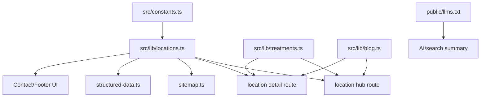

# Campo Grande SEO Migration Design

**Spec**: `.specs/features/campo-grande-seo-migration/spec.md`
**Status**: Draft

---

## Architecture Overview

Create a location-aware SEO layer that separates factual active practice data from future target-market planning. The first implementation PR should prepare the structure and safe draft behavior; the final launch PR should only flip confirmed facts from planned to active.



---

## Code Reuse Analysis

### Existing Components to Leverage

| Component | Location | How to Use |
| --- | --- | --- |
| `Breadcrumb` | `src/components/ui/Breadcrumb.tsx` | Reuse on location hub/detail pages |
| `CallToActionCard` | `src/components/ui/CallToActionCard.tsx` | Reuse for location and treatment CTAs |
| `Header` / `Footer` | `src/components/Header.tsx`, `src/components/Footer.tsx` | Add location links when routes exist |
| Blog model | `src/lib/blog.ts` | Reuse related post loading and metadata patterns |
| Treatment model | `src/lib/treatments.ts` | Reuse treatment data and related-post links |
| SEO helpers | `src/lib/seo.ts` | Reuse canonical, OG, Twitter metadata helpers |
| Structured data helpers | `src/lib/structured-data.ts` | Extend with location graph builders |
| Sitemap route | `src/app/sitemap.ts` | Add confirmed indexable locations only |
| E2E patterns | `tests/e2e/blog.spec.ts` | Extend with location/noindex/sitemap assertions |

### Integration Points

| System | Integration Method |
| --- | --- |
| Next.js App Router | Add `/locais-de-atendimento` and `/locais-de-atendimento/[slug]` routes |
| Sitemap | Read confirmed/indexable locations from `src/lib/locations.ts` |
| JSON-LD | Add location-aware `MedicalClinic` and `PostalAddress` graph only for confirmed locations |
| Blog/treatments | Cross-link locations, treatments, and related posts |
| AI summary | Replace stale `public/llm.txt` with current `public/llms.txt` content; optionally keep `llm.txt` alias |

---

## Components and Modules

### Location Model

- **Purpose**: Store confirmed and planned service-location data safely.
- **Location**: `src/lib/locations.ts`
- **Interfaces**:
  - `getAllLocations(): PracticeLocation[]`
  - `getIndexableLocations(): PracticeLocation[]`
  - `getLocationBySlug(slug: string): PracticeLocation | null`
  - `isLocationIndexable(location): boolean`
- **Dependencies**: `src/constants.ts`, related treatment/blog slugs.
- **Reuses**: Existing static-data style from `src/lib/treatments.ts`.

### Location Routes

- **Purpose**: Render local SEO hub and detail pages.
- **Location**:
  - `src/app/locais-de-atendimento/page.tsx`
  - `src/app/locais-de-atendimento/[slug]/page.tsx`
- **Interfaces**:
  - `generateMetadata()` uses confirmed/draft state for robots and canonical.
  - `generateStaticParams()` includes configured locations.
- **Dependencies**: `locations`, `treatments`, `blog`, SEO helpers, schema helpers.
- **Reuses**: Blog/treatment page route patterns.

### Location Structured Data

- **Purpose**: Emit accurate local schema only when facts are confirmed.
- **Location**: `src/lib/structured-data.ts`
- **Interfaces**:
  - `buildLocationGraph(location: PracticeLocation): Record<string, unknown>`
  - `buildLocationHubGraph(locations: PracticeLocation[]): Record<string, unknown>`
- **Dependencies**: `PracticeLocation`, `SITE_URL`, `Physician` global IDs.
- **Reuses**: `buildBreadcrumbGraph`, `serializeJsonLd`, global graph IDs.

### SEO/Crawler Summary

- **Purpose**: Keep AI/search-facing summary aligned with real site structure.
- **Location**: `public/llms.txt` and optionally `public/llm.txt`
- **Interfaces**: Static file consumed by crawlers and AI systems.
- **Dependencies**: Confirmed facts from constants/locations/treatments/blog.
- **Reuses**: Existing `public/llm.txt` content, corrected and expanded.

### Compliance Copy Pass

- **Purpose**: Reduce high-risk medical advertising language.
- **Location**: `content/posts/*.md`, `src/components/**/*.tsx`, possibly `docs/cfm-compliance-guidelines.md`.
- **Interfaces**: Content only.
- **Dependencies**: Compliance constraints from context.
- **Reuses**: Existing sober tone in treatment detail pages.

---

## Data Models

### PracticeLocation

```typescript
type LocationStatus = 'active' | 'planned' | 'historical'

interface PracticeLocation {
  slug: string
  name: string
  status: LocationStatus
  city: string
  state: string
  stateCode: string
  address?: {
    streetAddress: string
    neighborhood?: string
    addressLocality: string
    addressRegion: string
    postalCode: string
    addressCountry: 'BR'
  }
  geo?: {
    latitude: number
    longitude: number
  }
  phone?: string
  whatsappUrl?: string
  mapsUrl?: string
  roleDescription: string
  services: string[]
  relatedTreatmentSlugs: string[]
  relatedBlogSlugs: string[]
  faqs: Array<{ question: string; answer: string }>
  indexable: boolean
  showAppointmentCta: boolean
  lastUpdated: string
}
```

**Relationships**: A location references treatments and blog posts by slug. Planned locations can exist but must be `indexable: false` and have no active NAP/schema facts unless confirmed.

### Treatment FAQ Extension

```typescript
interface TreatmentFaq {
  question: string
  answer: string
}

interface Treatment {
  faqs?: TreatmentFaq[]
}
```

**Relationships**: Treatment FAQs render visibly on treatment pages and feed FAQ schema when present.

---

## Error Handling Strategy

| Error Scenario | Handling | User Impact |
| --- | --- | --- |
| Unknown location slug | `notFound()` | 404 page |
| Planned location missing address | Render transition-safe page/noindex or omit detail if configured | No false NAP |
| Planned location accidentally added to sitemap | Unit/e2e tests fail | Prevents indexing bug |
| Related treatment/blog slug missing | Filter nulls, no broken link | Page still renders |
| Confirmed location missing required NAP fields | Build/unit test fails | Forces complete facts before launch |

---

## Tech Decisions

| Decision | Choice | Rationale |
| --- | --- | --- |
| Keep location data in code | `src/lib/locations.ts` | Matches existing static treatment/blog architecture and avoids CMS overhead |
| Draft Campo Grande behavior | `noindex` + no sitemap + no active NAP claims | Lets SEO work be prepared without false local claims |
| Schema ownership | Physician works at/affiliated with clinic, not owner unless confirmed | Avoids false ownership |
| Rating schema | Omit until verified public review source exists | Avoids unverifiable trust signals |
| Campo Grande final switch | Small config/content PR after facts confirmed | Reduces launch risk |

---

## Launch Switch Points

When the doctor says "GO", review and update:

- `src/lib/locations.ts`: Campo Grande status, address, geo, map, phone, CTA, indexable.
- `src/constants.ts`: active SEO city/service area if Campo Grande becomes primary.
- `src/lib/structured-data.ts`: active `areaServed`, clinic graph, physician location relationship.
- `src/app/sitemap.ts`: include confirmed Campo Grande location page.
- `src/components/Contact.tsx` and `src/components/Footer.tsx`: visible NAP.
- `public/llms.txt` and `public/llm.txt`: location/service summary.
- Blog/treatment metadata for local intent, only where natural and non-duplicative.
